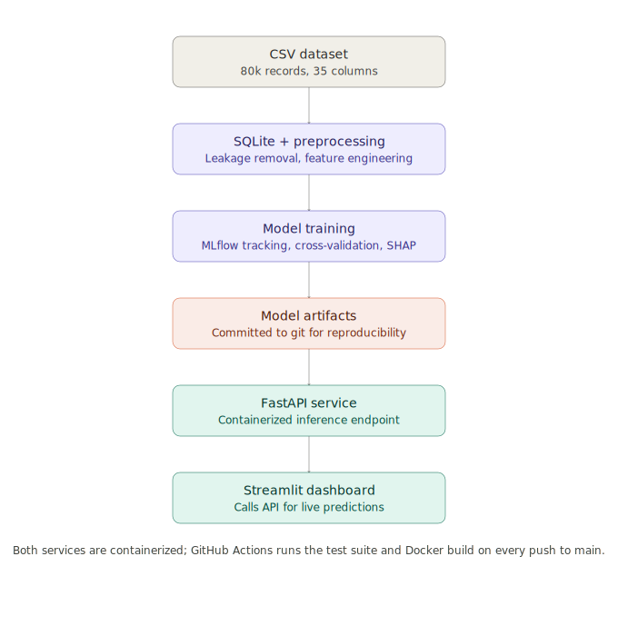

# Student Success Analytics Platform

End-to-end ML system analyzing student performance data: exploratory analysis, SQL-backed storage, feature engineering, predictive modeling (regression + classification), explainability, a served API, a dashboard, and CI/CD — runnable end-to-end with a single `docker compose up`.



## Quickstart

```bash
git clone https://github.com/Lanray-1/student-performance-analysis
cd student-performance-analysis
docker compose up
```

- **Dashboard:** http://localhost:8501
- **API docs (Swagger):** http://localhost:8000/docs

## Dataset

80,000 student records, 31 raw columns + 4 engineered features (35 total).

- **Regression target:** `exam_score` (continuous, 0–100, left-skewed with a ceiling at 100)
- **Classification target:** `dropout_risk` (binary, severely imbalanced — ~98% No / ~2% Yes)

Engineered features (built in `01_eda.ipynb`):
- `wellness_score` — composite of mental health, sleep, stress, exercise. Computed in `01_eda.ipynb`;
  excluded from model features in `04_feature_engineering.ipynb` due to exact multicollinearity
  (VIF = inf) with its component columns. See Known Limitations.
- `distraction_hours` — social media + Netflix hours combined. Same exclusion, same reason.
- `study_efficiency` — study hours relative to distraction hours
- `grade_tier` — categorical bucket derived directly from `exam_score`. **Reporting/EDA use only — excluded from all model features via `NON_FEATURE_COLS` in `src/config.py`, since it's a deterministic function of the regression target and would leak.**

## Model selection: naive beats XGBoost

`exam_score` is dominated almost entirely by `previous_gpa`. A naive single-feature Linear Regression baseline (`previous_gpa` only) achieves single-split RMSE 4.155 / R² 0.870 — full-feature XGBoost performs *worse* (RMSE 4.301 / R² 0.860), and a full-feature Linear Regression performs nearly identically to the naive baseline (RMSE 4.157 vs 4.155). Cross-validated numbers tell the same story with tighter uncertainty bounds: naive 4.178 ± 0.044, full linear 4.180 ± 0.044, XGBoost 4.348 ± 0.036 — the naive/linear gap is within one standard deviation (no formal significance test run to confirm it's not meaningful), while XGBoost's gap over naive is small but consistent across folds.

Feature ablation on the tuned XGBoost model corroborates this independently: removing `previous_gpa` alone increases test RMSE from 4.30 to 10.81 — by far the largest effect of any feature group — while removing other feature groups (wellness, study habits, demographics, engagement) slightly *decreases* RMSE, meaning they add marginal noise once `previous_gpa` is present. SHAP confirms `previous_gpa` dominates at ~5–6x the mean absolute SHAP value of the next feature, and a learning curve shows XGBoost isn't data-starved (train/validation RMSE converge early and stay flat).

The naive single-feature model was selected as the production model via an explicit rule (lowest CV RMSE; prefer the simpler model within 1% tolerance) — not by eyeballing a leaderboard. It also trains 27x faster than XGBoost (0.079s vs 2.13s). This is very likely a property of how the synthetic data was generated (`previous_gpa` probably drives the `exam_score` formula directly or near-directly), not a claim generalizable to real student performance data.

## Stack

SQLite · FastAPI · MLflow · Streamlit · scikit-learn / XGBoost · SMOTE (class imbalance) · SHAP (explainability) · pytest · Docker · GitHub Actions

## Project structure

```
notebooks/        sequential, numbered analysis notebooks (01_eda, 02_sql_layer, ...)
src/               reusable logic (config, database, preprocessing, features, training, prediction, diagnostics, explainability)
api/               FastAPI service exposing trained models
dashboard/         Streamlit frontend
tests/             unit tests, mirrors src/ structure (55 tests)
data/raw/          original CSV — a fixture is tracked in git for CI; see DECISIONS.md
data/processed/    cleaned exports, SQLite DB, EDA figures, diagnostic plots
models/            serialized trained model artifacts — committed to git (see DECISIONS.md, 2026-07-13 entry)
docs/diagrams/     architecture diagram(s)
```

## Progress

- [x] `01_eda.ipynb` — exploratory analysis, feature engineering, leakage check on `grade_tier`
- [x] `02_sql_layer.ipynb` — load cleaned data into SQLite, query layer (`src/database.py`)
- [x] `03_preprocessing.ipynb` — encoding, scaling, train/test split
- [x] `04_feature_engineering.ipynb` — VIF, RF importance, feature selection review
- [x] `05_training.ipynb` — regression + classification models, SMOTE for imbalance
- [x] `06_model_diagnostics.ipynb` — residuals, CV, ablation, model selection
- [x] `07_explainability.ipynb` — SHAP
- [x] FastAPI service — containerized, verified end-to-end
- [x] Streamlit dashboard — calls FastAPI for live predictions, verified end-to-end
- [x] Docker + CI/CD — clean-clone build verified, GitHub Actions green on main

## Known limitations

**`dropout_risk` is a near-deterministic synthetic rule, not realistic behavioral data.** A depth-2 decision tree achieves perfect classification (100% accuracy/precision/recall/ROC-AUC) on held-out test data using only two features:

```
stress_level > 1.56 SD above mean  AND  motivation_level < 0.69 SD below mean  →  dropout = 1
(every other combination → dropout = 0)
```

XGBoost's perfect scores in `05_training.ipynb` reflect this dataset property, not a breakthrough model — there's no genuine generalization challenge in this target. Reported transparently rather than presented as a result.

**`exam_score` is dominated almost entirely by `previous_gpa`.** See [Model selection](#model-selection-naive-beats-xgboost) above.

**`exam_anxiety_score` is bounded at a minimum of 5, not 0.** The scale doesn't capture a true "no anxiety" floor, so low scores should be read as relatively low rather than an absolute absence of anxiety.

**Residual heteroscedasticity.** `exam_score` predictions show non-constant residual variance near the 100-point ceiling — a ceiling effect, not a modeling defect. Standard OLS inference (p-values, coefficient CIs) isn't strictly valid without correction; point predictions remain usable.

**Both targets are easier here than they'd be on real data, and that's a property of the synthetic generator, not a claim about the modeling approach.** A depth-2 decision tree solving `dropout_risk` and a single feature explaining ~87% of `exam_score` variance both indicate the data was generated from a small number of deterministic or near-deterministic rules. On real student data, I'd expect: the `previous_gpa` → `exam_score` relationship to be noisier and confounded by unmeasured factors (course difficulty, instructor, life events), no clean low-dimensional rule separating dropout from non-dropout, and the engineered behavioral features (study habits, wellness, screen time) to carry real incremental signal instead of adding noise once `previous_gpa` is controlled for. In that setting, SMOTE and ensemble methods like XGBoost would likely earn their place instead of losing to a one-feature linear baseline — the diagnostics pipeline built here (ablation, SHAP, CV, learning curves) is the part designed to transfer to that harder problem; the specific model choice is not.

## Running tests locally

```bash
pip install -r requirements.txt
pytest tests/ -v
```

## Exploring the analysis

Run notebooks in numbered order from `notebooks/`. `src/` is imported via `sys.path` insertion at the top of each notebook (see `02_sql_layer.ipynb` for the pattern).
